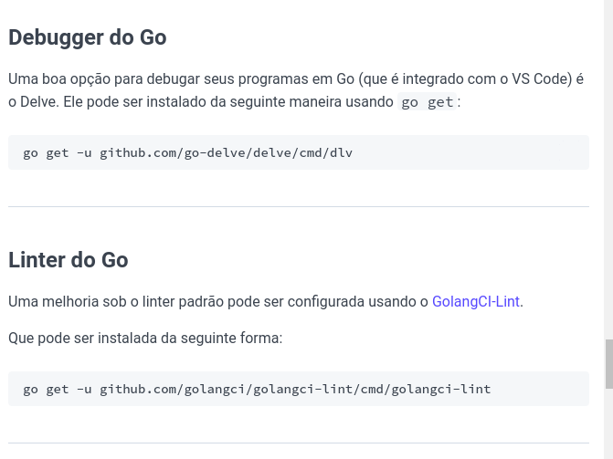

# Aprendendo Go com testes

Separar o dominio (regras de negocio) dos efeitos colaterais, no caso do hello world é o println



## regras de teste em go

Tem que estar em um arquivo xxx_test.go

função de teste precisa começar com Test

recebe um unico parametro, t *testing.T

t do tipo *testing.T é a porta de entrada para a ferramenta de testes

pode usar o t.Fail() quando precisa relatar um erro

Verificar o codigo v2 do hello world no github

if é como em outras linguagens

declaração de variaveis com a sintaxe := permite nao declarar o tipo e assumir qualquer um

t.Errorf, imprime a mensagem se o teste falhar, o sufixo de f no final é para informar que é para formatar a string (igual no printf do c)

Os codigos estao no github separados por pastar v1 v2 v3, especificamente para separar as versoes dos testes e ir progredindo

## Hello world aceitando string vazia

- Exemplo com subtestes
    
    ```go
    t.Run("diz olá para as pessoas", func(t *testing.T) {
    		resultado := Ola("Moraski")
    		esperado := "Olá, Moraski"
    
    		if resultado != esperado {
    			t.Errorf("resultado '%s', esperado '%s'", resultado, esperado)
    		}
    	})
    ```
    

Subtestes sao uma importante ferramenta do TDD, pq podemos agrupar os testes em torno de uma coisa e descrever diferentes cenarios

O beneficio dos subtestes que voce cria um codigo que pode ser compartilhado com outros testes

Existe um codigo repetido na hora de verificar a mensagem

Refatoração não serve apenas para os código em produção

- Refatoração da verificação da mensagem
    
    ```go
    verificarSaidaTeste := func (t *testing.T, resultado, esperado, string) {
    		t.Helper()
    		if resultado != esperado {
    			t.Errorf("resultado '%s', esperado '%s'", resultado, esperado)
    		}
    	}
    
    	// Apresentado os subtestes
    	t.Run("diz olá para as pessoas", func(t *testing.T) {
    		resultado := Ola("Moraski")
    		esperado := "Olá, Moraski"
    		verificarSaidaTeste(t, resultado, esperado)
    	})
    
    	t.Run("diz 'Olá mundo' quando uma string vazia for passada", func(t *testing.T) {
    		resultado := Ola("")
    		esperado := "Olá, mundo"
    		verificarSaidaTeste(t, resultado, esperado)
    	})
    ```
    

Apos a refatoração vemos que vc pode declarar funções dentro de outras funções e atribuir a variaveis, e pode chamar como um função normal, o t testing é passdao como parametro para dizer ao codigo de teste que ele falhara quando necessario

o t.helper() é um necessario pois é um codigo auxiliar que retornaa a linha de onde esta o erro para sabermos qual dos subtestes esta errado

## Processos de testes

- Escrever um teste
- Compilar o codigo sem erros
- Rodar o teste, ver o teste falahr e certificado que a mensagem de erro faz sentido
- Escrever a quantidade minima de codigo para o teste passar
- Refatorar (codigo e o teste)

Pode parecer tedioso, mas se manter este ciclo ele é importante

Ajuda o software ser bem projetado e seguro

Economiza tempo a longo prazo de teste

- Ultimas refatorações
    
    ```go
    func Ola(nome string, idioma string) string {
    	if nome == "" {
    		nome = "mundo"
    	}
    	return prefixoSaudacao(idioma) + nome
    }
    
    func prefixoSaudacao(idioma string) (prefixo string) {
    	switch idioma {
    	case "frances":
    		prefixo = prefixoOlaFrances
    	case "espanhol":
    		prefixo = prefixoOlaEspanhol
    	case "japones":
    		prefixo = prefixoOlaJapones
    	case "ingles":
    		prefixo = prefixoOlaIngles
    	default:
    		prefixo = prefixoOlaPortugues
    	}
    	return
    }
    ```
    

Na criação da função o valor de retorno é prefixo string, o valor atribuido sera o valor zero para aquela variavel, e também é possivel retornar apenas indicando return, pois ele ira retornar aquela variavel

Funções em go

Primeira letra maiscula = publica 

Primeira letra minuscula = privada

## Etapas do TDD e porque sao importantes

- Escreva um teste que falhe e veja-o falhar, para que podemos saber que escrevemos um teste relevante para nossos requisitos e viso que ele produz uma descrição facil da falha
- Escrever a menor quantidade de codigo para o teste passar, para que saibamos que o software esta funcionando
- Em seguida, refatorar tendo a segurança de nossos testes  para garantir que tenhamos um codigo bem feito e facil de trabalhar

No caso do exemplo, passamos de Ola() para Ola(”nome”) e Ola(”nome”, “espanhol”) em etapas faceis de entender

Precisaa manter os principios, o TDD é um uma habilidade que necessita de partica para se desenvolver, no entando sera muito mais facil escrever bons softwares se conseguir dividir os problemas e pedaços menores para que possa testar